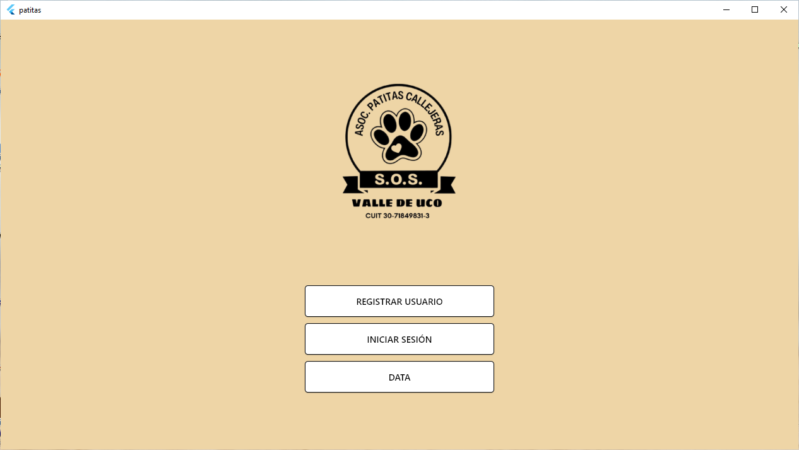
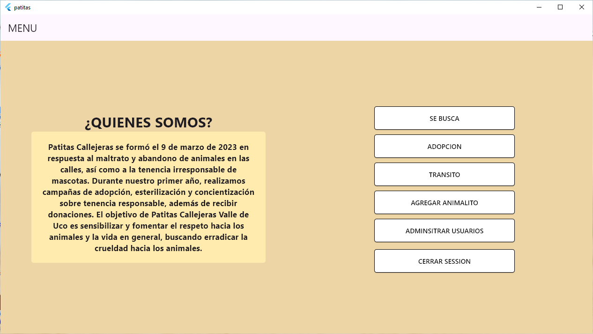
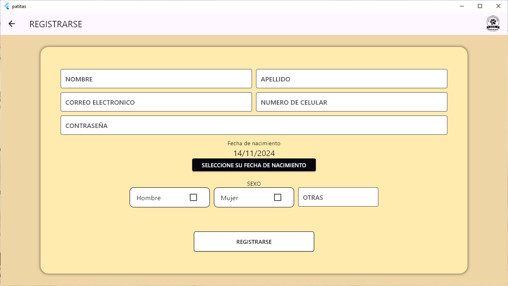

# patitas
Patitas Callejeras se formó el 9 de marzo de 2023 en respuesta al maltrato y abandono de animales en las calles, así como a la tenencia irresponsable de mascotas. Durante nuestro primer año, realizamos campañas de adopción, esterilización y concientización sobre tenencia responsable, además de recibir donaciones. El objetivo de Patitas Callejeras Valle de Uco es sensibilizar y fomentar el respeto hacia los animales y la vida en general, buscando erradicar la crueldad hacia los animales.

